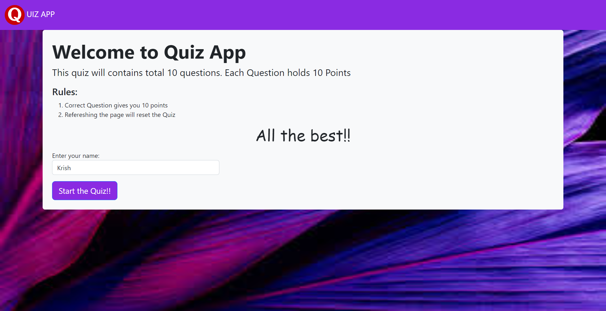
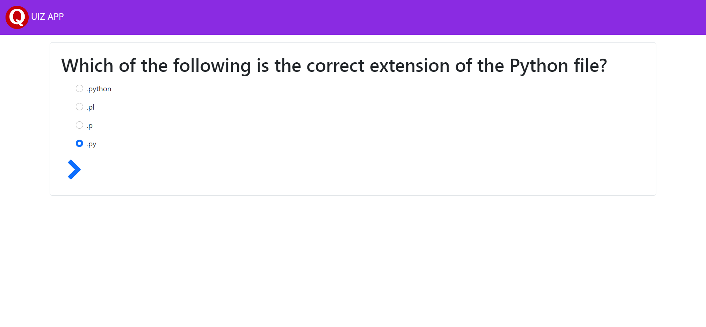
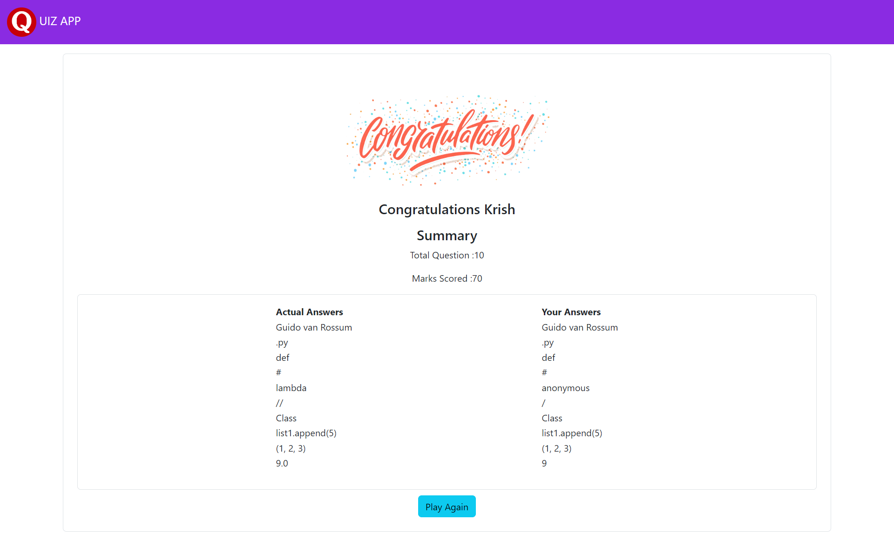

# QuizApp
<h3>Demo run - </h3>

<h1 [align]="center">Home  Page </h1>

Home page: Create a home component in Angular that provides instructions on how to take the quiz. Include a form where users can enter their name. When the form is submitted, store the user's name in a session variable in your Java backend.

<h1 [align]="center">Quiz Page </h1>

Quiz questions: Create a MySQL table called "questions" with columns for the question prompt, answer options, and correct answer. Populate the table with your set of quiz questions.
Create a quiz component in Angular that queries the Java backend for the quiz questions from the "questions" table. Display each question and its answer options to the user. Use the Angular forms module to create a form that allows the user to select an answer for each question.

<h1 [align]="center">Result Page </h1>

When the user submits their answers, send them to the Java backend for grading. The Java backend should compare the user's answers to the correct answers stored in the "questions" table, calculate the user's score, and store the score in the database along with the user's name.
Create a results component in Angular that displays the user's score and a summary of the questions and the user's selected answers. Include the correct answers for each question.

